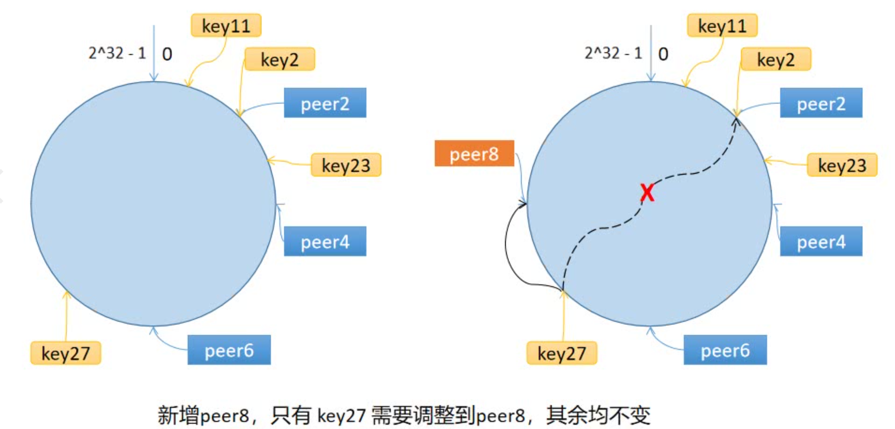

这个仓库是对GeeCache【geektutu.com】的学习，通过七天，逐步完成了一个分布式缓存系统：
- 第一天：LRU缓存策略，学习了缓存的数据更新方法和存储的底层实现，用双向链表存储数据，保证对数据增加删除时的时间复杂度O(1)，再用一个map来保存key和对应存储value的链表element的关系。
- 第二天：单机并发缓存，学习了mutex的使用，通过新结构体封装mutex和之前的LRU存储，保证对并发的支持。学习了接口型函数【函数也是一等公民，可以实现接口，这样在参数是这个接口的时候，可以传入结构体也可以传入函数】【https://geektutu.com/post/7days-golang-q1.html】
- 第三天：HTTP服务端，分布式节点的通信也是通过HTTP访问的，所以每个节点都是一个HTTP服务端，根据GET请求，调用自己的缓存查找策略，访问的缓存和key是通过GET的URL区分的。
- 第四天：一致性哈希，学习到了一致性哈希算法，对同一个数据的访问不会随机节点，而是映射到同一个节点上，通过哈希环实现。

- 第五天：分布式节点，实现了分布式节点的HTTP客户端，
- 第六天：防止缓存击穿，学习了缓存雪崩、缓存穿透、缓存击穿，使用waitgroup来保证只有一个goroutine执行动作，其他的goroutine等待。避免同时发送请求。
>  缓存雪崩：缓存在同一时刻全部失效，造成瞬时DB请求量大、压力骤增，引起雪崩。缓存雪崩通常因为缓存服务器宕机、缓存的 key 设置了相同的过期时间等引起。
>
> 缓存击穿：一个存在的key，在缓存过期的一刻，同时有大量的请求，这些请求都会击穿到 DB ，造成瞬时DB请求量大、压力骤增。
>
> 缓存穿透：查询一个不存在的数据，因为不存在则不会写到缓存中，所以每次都会去请求 DB，如果瞬间流量过大，穿透到 DB，导致宕机。
- 第七天：Protobuf 通信，学习了用protobuf通信的in、out方法

> 先实现一个不支持并发的底层模型，再新建一个结构体，封装mutex和这个底层模型，在调用底层方法前用mutex保护住。
